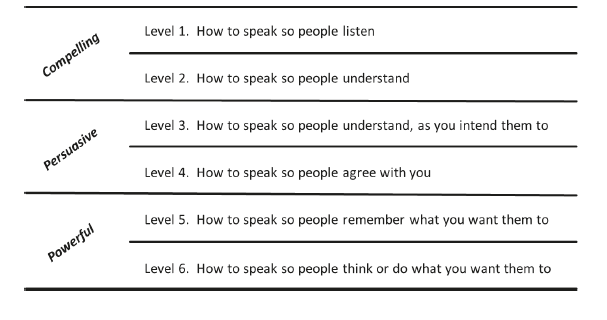
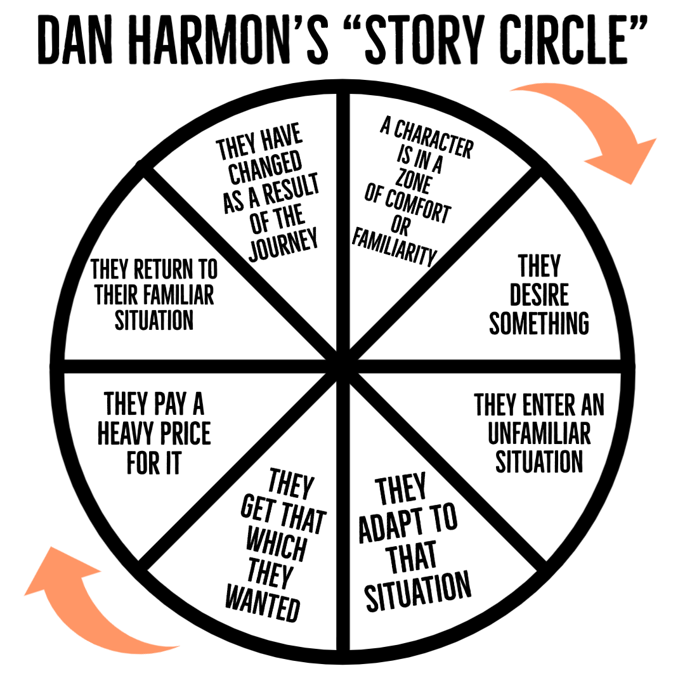

## Levels of speaking

For me, this picture was really valuable. I always had a problem (and actually still have) that most people don't listen to me. I can't find strong arguments which allow me to be heard. And I thought that something was wrong with me, maybe my gender or my voice or my face. 

This book opened to me another idea. Probably I don't have certain communication skills to deliver information to the other person. And I really want to go and experiment. 

Here in the picture, we have 6 levels of communication. And it seems that if I don't know how to tell a good story I can't grab attention. Everything builds up on a good old story. And this is the first skill that I want to acquire.

I'll discuss other levels too in future posts. But let's eat frogs one by one. 

Since all this suffering is for communication, where at least two people, I'd like to start with small talk.

## Small-talk technique - Communication loop

 I'm just imagining the situation where I came into the event in a group or a new job where I don't know anybody. This is an opportunity to make new connections.

### First part
1. Ask a question
2. Wait for an answer
3. Add something personal to the same question
4. Wait for the reply
5. If there's no reply, ask another question with another topic

### Second part
1. Open the topic with the story
2. Wait for the reply 
3. Ask questions about the topic

The first technique should be simple. I just have to practice creating new questions in my mind. The second part is more difficult - I need to develop a sotrytelling technique. It also would be the first step of persuasive speaking. 

## Storytelling

Here I'm imagining myself in the awkward situation where the chief storyteller goes out to smoke and we are sitting in the circle and feeling silence between us. This is an opportunity to tell a story. Also, I get questions about my books, which I sometimes like to recommend - also the story. And here how can  I tell it:

### Structure

The basic structure of the story is listed in the next picture with the story cycle proposed by Dan Harmon. Also, you can use a link to the YouTube video with an example (Ukrainian language).

As an example (from the YouTube video, really good story though): 
1. Our hero Orest is a simple character from the village who goes and digs potatoes in his garden.
2. He wants to go into space someday.
3. He goes out of his comfort zone and fills out the online form to join Space Crew.
  - Here also be noted how he is invited into the crew.
  - And listed a few funny situations in how this is complicated for him.
4. Now Orest is fine with his new role, his strength and character allowed him to be at the top of the team. But suddenly he finds his love - Susie.
5. Orest is getting an astronaut certificate and he is assigned to the moon mission.
6. Suddenly Orest understands that Susie has declined and won't fly into space.
7. Orest in space, digging his potatoes as in usual life.
8. Orest changed, he wanted space but now he wanted love. We can repeat the story with Susie. 

### Story plots

- **Undiscovered weakness**: A person or products head to the crash.
- **The price**: Easy deal later showed as a price must be paid.
- **Unrequited love**: Love at a distance is resolved by surprised fulfillment.
- **Doomed love**: Hero's love gets him to the death.
- **The trap**: The hunter sets the trap, and despite many misses, their prey is captured.
- **Undiscovered treasure**: Talented hero is unappreciated until his talent is uncovered.
- **A loss**: Losing something is more interesting than never having it. 
- **The search for what is lost**: often accompanied by paying a price if it is found.
- **Triumph against distress**: The hero should hit the road to his greatest fears.
- **The return home**: There is a lot of tension in the return journey and what awaits us at home.
- **The solution**: A challenge is set which the hero must solve usually at a personal cost.
- **Together in distress**: Dissimilar personalities are thrown together and must get along through a series of challenges.
- **Succumbing to fear**: The hero's fears led him to the bad action. Now it's time to pay the price. 

## How I'm going to learn it

### Storytelling
1. Analyze stories based on the story circle (Storyworthy, On writing Steven's King)
2. Finish storyworthy (and create an article with new techniques)
3. Create a few stories about myself based on the Story Circle
4. Tell these stories to my phone, then to my husband, then into Instagram 
5. Evaluate progress and create next steps

### Small talk
1. Skimm questions before the events where small talk could appear (maybe copy it into the phone)
2. If I am in the event - go and ask, even if it is so scary
3. When I feel more comfortable, describe all of this in the form of the story 
4. At home: spend 5-10 minutes playing communication loop with myself. I can use a question generator or a noun generator. 

Extra: Small talk learning it's a good opportunity for story **Triumph against distress**

## References
- [How to Speak so People Listen](https://www.amazon.com/How-Speak-People-Listen-Attention/dp/0273786377)  
- [StoryCircle [UA]](https://www.youtube.com/watch?v=Uc1VJBewufg&ab_channel=%D0%92%D0%BB%D0%B0%D0%B4%D0%A1%D1%82%D0%BE%D1%80%D1%96%D1%82%D0%B5%D0%BB%D0%B5%D1%80)  
- [5 questions for the start of the story [UA]](https://www.youtube.com/watch?v=ureqUMDaEEk&list=PLwZWgGh3oe0Pq0pRBoD2dHLPObzwwo2S5&index=3&t=492s&ab_channel=%D0%92%D0%BB%D0%B0%D0%B4%D0%A1%D1%82%D0%BE%D1%80%D1%96%D1%82%D0%B5%D0%BB%D0%B5%D1%80)  
- [Storyworthy](https://www.amazon.com/Storyworthy-Engage-Persuade-through-Storytelling/dp/1608685489)  
- [Communication loop [RU]](https://www.youtube.com/watch?v=J13Nc58vHx4&t=41s&ab_channel=%D0%94%D0%BC%D0%B8%D1%82%D1%80%D0%B8%D0%B9%D0%A2%D1%80%D0%BE%D1%84%D0%B8%D0%BC%D0%BE%D0%B2)  